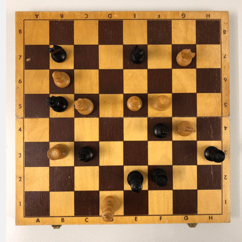
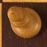
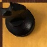
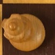
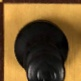

# ChessML

This project was developed within the scope of independent studies at the [University of Trier](https://www.uni-trier.de/). The main purpose was to get an overview of current machine learning techniques and especially Convolutional Neural Networks.

ChessML performs a basic board localization and piece recognition from photographs made from the above of a chessboard. This is done using [OpenCV](https://opencv.org/) for image processing and [PyTorch](https://pytorch.org/) as framework for the neural network. The training/validation data was generated and labeled by myself and is available [here](https://drive.google.com/file/d/1TKDfcIpuD7qyaxXSBfxeuh4S9vQa653_/view?usp=sharing).

## Board Localization

The localization of the chessboard uses basically the same idea as in the tutorial of Nesh Patel [[1]] on localization sudoku fields with a few adaptions. The process breaks down to 9 parts:

  

1. Grayscaling the image
2. Bluring the image
3. Edge detection using [Canny edge detector](https://en.wikipedia.org/wiki/Canny_edge_detector)
4. [Dilate](https://docs.opencv.org/2.4/modules/imgproc/doc/filtering.html?highlight=dilate#dilate) to get thicker lines
5. [Hough transform](https://en.wikipedia.org/wiki/Hough_transform) to identify horziontal and vertical lines
6. Calculation of the intersections of the lines
7. Clustering of the interesections
8. Identifying the corners of the chessboard
9. Warping the image

After this, the image is cutted into 64 tiles which are then saved in an output directory:

  
  
  
  
  ...

## Piece Recognition

The data for training the neural network is based on 417 photographs of one chessboard which resulted in 3900 training (300 per chess piece + empty fields) and 7.800 validation images. Each image was labeled using a simple labeling tool which was specially designed for labeling the chess pieces. It simply moves every image to a corresponding folder with the class name of the piece as name. Afterwards the data was augmented using this [script](data/data_augmention.py). The process ended up in 31.200 training and 7.800 validation images.

To get a better understanding on how convolutional neural networks work the first version was build as a completely new CNN which was trained on [Google Colab](https://colab.research.google.com/). The results are shown below:

Chess pieces are labeled using their common notation:

> bb = Black Bishop 
> bk = Black King 
> bn = Black Knight 
> bp = Black Pawn 
> bq = Black Queen 
> br = Black Rook 
> ...

### First training

Epochs: 50 
Best-Accuracy after epoch: 35 
Best-Accuracy: 62.56%

Piece  | White | Black
------ | ----- | -----
Bishop | 74 %  | 24 %
King   | 77 %  | 38 %
Knight | 85 %  | 83 %
Pawn   | 53 %  | 59 %
Queen  | 35 %  | 66 %
Rook   | 63 %  | 51 %
Empty  | 100 %

### Second training

Since the result of the first training had a very poor accuracy the training was done again using a pretrained version of resnet18 from PyTorch. The result was pretty good and it ended up with an accuracy of 99%.

Epochs: 20 
Best-Accuracy after epoch: 12 
Best-Accuracy: 99.00%

Piece  | White  | Black
------ | ------ | ------
Pawn   | 99 \%  | 100 \%
Queen  | 98 \%  | 96 \%
King   | 98 \%  | 99 \%
Bishop | 98 \%  | 96 \%
Knight | 100 \% | 99 \%
Rook   | 100 \% | 100 \%
Empty  | 100 \%

## TODO

- Finish README.md
- Improvement of the board localisation (error handling etc.)
- More data for different type of chessboards and pieces
- Generation of FEN
- App for analyzing board situations
- Recommendation for the next move

## Related Work

When the idea for the project came up, it was almost certainly clear that somebody out there must have had the same idea. Many parts of the board localization are based on [[1], [2]].

## References

\[1\] [https://medium.com/@daylenyang/building-chess-id-99afa57326cd](mailto:https://medium.com/@daylenyang/building-chess-id-99afa57326cd) 
\[2\] [https://medium.com/@neshpatel/solving-sudoku-part-ii-9a7019d196a2](mailto:https://medium.com/@neshpatel/solving-sudoku-part-ii-9a7019d196a2)

[1]: https://medium.com/@daylenyang/building-chess-id-99afa57326cd
[2]: https://medium.com/@neshpatel/solving-sudoku-part-ii-9a7019d196a2
